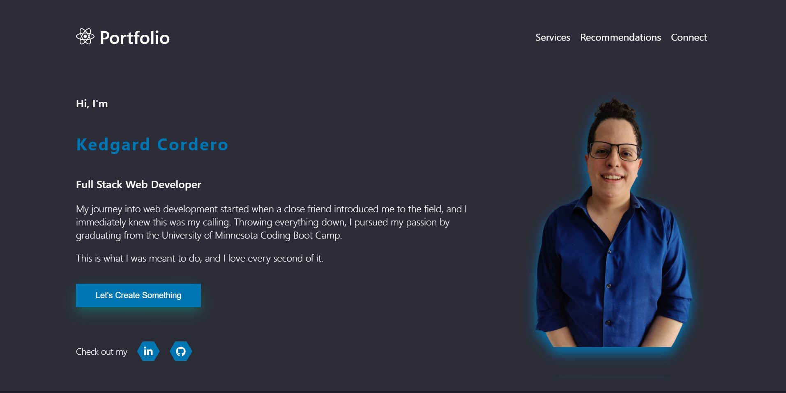

# Kedgard Cordero's Website

## Table of Contents
- [License](#license)
- [Description](#description)
- [Motivation](#motivation)
- [Technologies](#technologies)
- [Features](#features)
- [Deployment](#Deployment)
- [Troubleshooting](#troubleshooting)

## License
This project is licensed under the MIT license.

## Description
Kedgard Cordero's personal website! Learn more about me, and contact me if you wish!

## Motivation
I wanted to push myself and create a better personal website, other than the website that was required in the Minnesota Coding Bootcamp. There were many restrictions on that portfolio, and I knew that I could do better! 

## Technologies
Styled-components:
Styled-components is a popular CSS-in-JS library for React that allows you to write CSS code directly in your JavaScript code. It provides a more intuitive and component-based way of styling React components, allowing you to keep your styles closely tied to your components. This makes it easier to maintain and refactor your code, and allows for greater flexibility and dynamic styling.

React-icons:
React-icons is a library of popular icons that can be easily integrated into your React projects. It provides a collection of over 1,000 icons from popular icon sets such as Font Awesome, Material Icons, and Ionicons, all of which can be easily used in your React components. This library can save time and effort in finding and integrating icons into your projects, and helps ensure consistency across your UI.

React-Slick:
React-Slick is a popular carousel component for React that allows you to easily create a responsive carousel or slider for your website. It provides a number of useful features, such as lazy loading, infinite scrolling, and touch swipe support, and can be easily customized to fit your design needs. Compared to the carousel component from react-bootstrap, React-Slick is more flexible and customizable, and provides a wider range of features.

## Features
Visitors can see recommendations made by others, can contact me through email if they wish.

## Deployment
Due to this portfolio being a SPA, I have decided to simply use GitPages for the deployment. You can view the site [here](https://kenny4297.github.io/Website/).

## Troubleshooting
This was my first time using 'styled-components', and it was difficult to spot errors in the CSS section, due to the styling being a string, and not actual CSS. I resolved this by installing the extension 'vscode-styled-components', an extension that turns the original text into color coordinated CSS styling. This makes it easier for me to spot mistakes and results in cleaner code.

I was using react-awesome-reveal for loading the entire website with the `<Fade/ >` animation. When the page loaded, for a split second you could see the entire DOM how it should look, and *then* the `<Fade />` animation kicked in. I was not able to find anything on Google about this issue, so I decided to ditch it, and create the Fade animation with CSS. This ended up working perfectly, as there was no 'split second DOM' occurring before the Fade animation.

## Testing
In the root folder, enter 'npm test' to run the tests.

My focus on testing was making sure all the key parts of the website were functional: navigation, UI (such as the spinning react logo and the glowing button), and making sure the user entered correct information in the Contact section.

My goal is to use jest for testing, in the following ways:
EmailJS Integration, Website Layout, Load Time, Accessibility, and error Error Handling. These may change throughout the development process.

If you have any suggestions for improvement, please feel free to share them with me.

